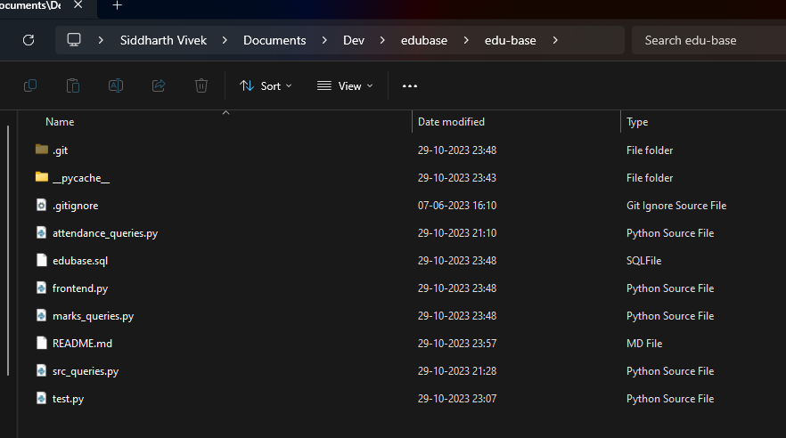
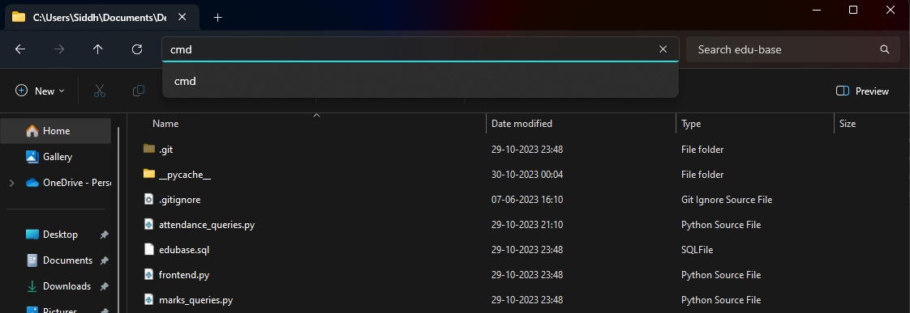
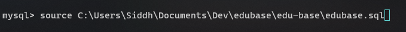
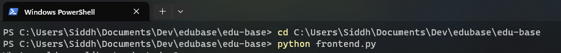

# eduBase
### Classroom management done better
A class XII CBSE Computer Science project by [Siddharth Vivek](https://github.com/Gargantuan5K), [Kanishk Malhotra](https://github.com/KanishkM08) and [Nandan Sensarma](https://github.com)

## Instructions for Setup
1. Download the ZIP of the source code available here.
2. Extract the ZIP, and **open the folder in terminal**:



3. Open **MySQL Command Line Client**

Type the following (as shown):

```source <path>/<to>/<folder>/edubase.sql```


4. In the terminal window within the folder **(STEP 2)**, enter the following (shown)

```python frontend.py```
